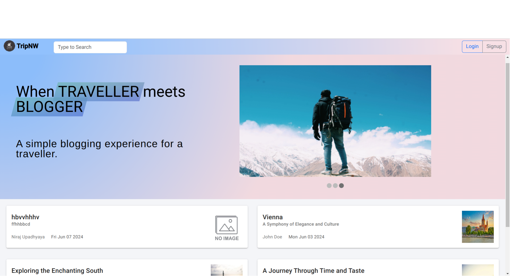
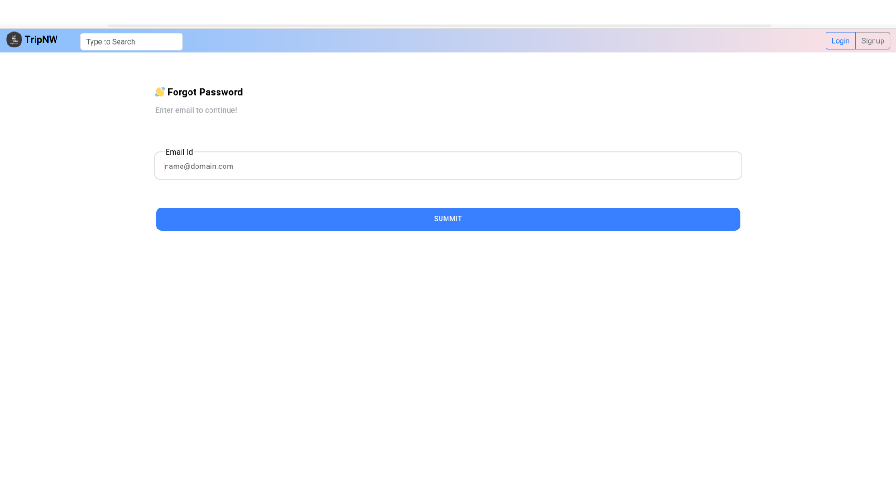

# Travel Blogging (TripNW)

Travel Blog is a dynamic single-page web application designed for travel enthusiasts to read
and write their travel experiences with the world. It provides an engaging platform where users
can create and organize their travel posts in a structured format, making it easier for others to
discover and enjoy their stories. Unlike general social media platforms, Travel Blog focuses
specifically on travel blogging, ensuring that articles are well-organized and optimized for search
engine indexing.
When users visit the Travel Blog website, they are greeted with the home page displaying recent
posts. The toolbar includes login and signup buttons, directing users to the respective pages. If a
user is not registered, the signup process will guide them through entering their details and
verifying their information. Successful registration automatically logs the user in and redirects
them to the home page. If there are any issues during the signup, such as already registered emails
or invalid data, appropriate notifications will be displayed. The application supports traditional
email and password login, third-party login through Google, and a streamlined signup process.
New users can register by providing their details (Name, Gender, Date of Birth, Email, and
Password), and the system ensures the provided information is valid, checking for existing
registrations to avoid duplicates.
Upon logging in, users can access their blogs through the "My Blog". A floating write icon in
"My Blog" provides quick access to the text editor for creating new posts. Users can compose
detailed travel articles using a rich text editor that supports headings, subheadings, and multimedia
elements such as photos and YouTube links. The editor also includes a preview feature, allowing
users to see their posts before publishing.
Visitors can explore the content by scrolling through recent posts in descending order of date.
Although they cannot react to posts without logging in, they can still read and enjoy the articles.
Logged-in users can react to posts with likes or dislikes, can leave comments and nested replies,
fostering a vibrant community of travelers.
Logged-in users can access their profiles to view their posts, followers and they can also edit
their profile details. The users interact with other users by visiting their profile to check followers,
social account, bio, profile photo and total number of read to all of the posts of person to know
their popularity.


## Technology Stack

MySQL, Sequelize ORM, Express JS, Socket.IO, Angular, Ionic

## Environment Variables

To run this project, you will need to add the following environment variables to your config.env file in the backend

`NODE_ENV`
`CROSS_ORIGIN`
`JWT_SECRET`
`COOKIE_SECRET`
`DATABASE_NAME`
`DATABASE_USERNAME`
`DATABASE_PASSWORD`
`DATABASE_PORT`
`DATABASE_HOST`
`APP_PORT`
`COOKIE_DOMAIN`
`DEV_MAIL_USERNAME`
`DEV_MAIL_PASSWORD`
`DEV_MAIL_HOST`
`DEV_MAIL_PORT`
`DEV_MAIL_SOURCE`
`PROD_MAIL_SOURCE`
`PROD_MAIL_PASSWORD`
`MESSAGE_PADDING`
`GOOGLE_CLIENT_ID`
`GOOGLE_CLIENT_SECRET`

In the frontEnd directory create env.ts and add environemnt variabe:

`url` --> backend url

`clientId` --> google client Id


## Running & Deployment

Installation and setup:
First navigate to backend directory and
```bash
    npm install
```
And then navigate to frontEnd directory and 
```bash
    npm install
```

Running in development Mode :
In the backend directory run 
```bash
    npm run dev 
```
In the frontEnd deirectory run 
```bash
    ionic serve
```

Running in Production Mode : 
In the backend directory run
```bash
    npm run prod
```
In the frontEnd directory run 
```bash
    ionic serve
```

Building frontend pre-deployment:
```bash
    ng build --configuration production --output-hashing none
```

## User manual

Getting Started:


Home Page

When you visit the Travel Blog website, you will be greeted with the home page displaying
recent posts.

The toolbar includes Login and Signup buttons for user authentication.


User Registration and Login

Signing Up

Click on the Signup button in the toolbar.

Fill in the required details: Name, Gender, Date of Birth, Email, and Password.

Complete the verification process as instructed.

On successful registration, you will be automatically logged in and redirected to the home
page.

If any issues arise, such as an already registered email or invalid data, appropriate
notifications will be displayed.


Logging In

You can log in using your email and password or through third-party login via Google.

After logging in, you will be redirected to the home page.

Creating and Managing Blog Posts


Accessing "My Blog":

Once logged in, click on My Blog to view your posts.

A floating write icon will appear in My Blog for quick access to the text editor.


Writing a Post:

Click the floating write icon to open the rich text editor.

Compose your travel article using features like headings, subheadings, photos, and
YouTube links.

Use the preview feature to see how your post will appear before publishing.

Click Publish to share your post with the community.

Interacting with Content


Reading Posts:

Visitors can scroll through recent posts on the home page.

Logged-in users can like or dislike posts, leave comments, and reply to comments.


Comments and Reactions:

Logged-in users can react to posts with likes or dislikes and leave comments.

Comments can have nested replies, allowing for in-depth 
discussions.


User Profiles


Viewing Profiles:

Click on a user’s profile to view their posts, followers, social accounts, bio, profile
photo, and total number of reads.


Editing Your Profile:

Logged-in users can access their profiles and click edit to edit details such as name,
bio, and profile photo.
Connecting with Other Users


Following Users:

If you find a user's posts attractive, you can follow them to stay updated with their
latest posts.

Chat Feature:

Logged-in users can use the Message feature from profile of other person to connect
and communicate with other members of the Travel Blog community.


Discovering Content


Search Function:

Use the search bar to find specific posts or blogs, making it easy to locate relevant
travel content.

## Demo
Home Page (Before Login)



Login Page


Home page(After Login)


Preview of Blog


Preview of Comment Section


Text Editor


Profile Page


Preview of Chat


Preview of Forgot Password



## Authors

- [@Junaid Ahmed Laskar](https://github.com/Juned-1)
- [@Bikram Upadhyaya](https://github.com/bikram2022)


## 🔗 Links to Web

- [@tripNW](#)
